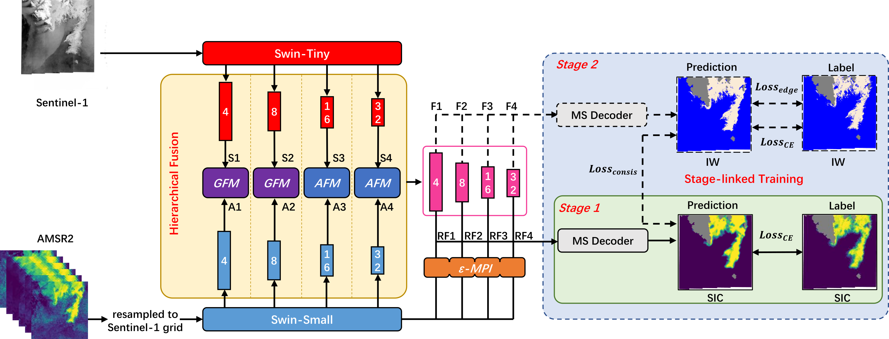

# SLAP-HiFNet

This repository provides the core implementation of **SLAP-HiFNet: A Stage-Linked Active--Passive Microwave Hierarchical Fusion Network with Label-Efficient Transfer Learning for Sea Ice Mapping**.

SLAP-HiFNet is designed for Arctic sea ice mapping using Sentinel-1 SAR and AMSR2 passive microwave observations. The framework combines hierarchical active--passive microwave feature fusion with a stage-linked training strategy. It first uses readily available sea ice concentration (SIC) products for pretraining, and then transfers the learned representations to the label-scarce ice-water classification (IW) task.

(This repository provides the core implementation used in the manuscript. Additional utilities, pretrained checkpoints, and dataset preparation scripts will be progressively organized and released.)

## 1. Introduction

This repository provides the training, testing, evaluation, and visualization code for SLAP-HiFNet and the main baseline models used in the paper.

The main contents include:

- active--passive microwave fusion based on Sentinel-1 SAR and AMSR2 observations;
- stage-linked training for SIC pretraining and SIC-IW joint training;
- hierarchical fusion modules for multi-scale feature interaction;
- dual-task prediction for SIC and IW mapping;
- baseline models including single-source input, input-level fusion, and feature-level fusion networks;
- training, testing, metric calculation, and visualization scripts.

## 2. Repository Structure

```text
SLAP-HiFNet/
├── dataloaders/          # Data loading and preprocessing utilities
├── dataset/              # Dataset JSON files and JSON generation scripts
├── models/               # SLAP-HiFNet and baseline model definitions
├── options/              # Configuration files for different models and training stages
├── readme_image/         # Images used in this README
├── utils/                # Loss functions, evaluation metrics, LR schedulers, and helper functions
├── train.py              # Training entry script
├── test.py               # Testing, evaluation, and visualization entry script
├── LICENSE
└── README.md
```

## 3. Method Overview

SLAP-HiFNet adopts a dual-branch encoder architecture to extract multi-scale features from Sentinel-1 SAR and AMSR2 observations. Lightweight gated fusion is used at shallow network scales, while attention-based fusion is used at deeper semantic scales. This design enables hierarchical active--passive microwave feature interaction across different network levels.

In addition, an AMSR2 prior residual injection module is introduced into the SIC branch to enhance the use of passive microwave information for SIC prediction, while reducing interference with IW structural representation learning.

The training workflow consists of two stages:

1. **Stage 1: SIC pretraining**

   The network is pretrained using large-scale and readily available SIC products as supervision. This stage allows the model to learn stable large-scale sea ice distribution representations.

2. **Stage 2: SIC-IW joint training**

   The model is initialized with Stage 1 weights and further trained using limited manually annotated IW labels together with the corresponding SIC labels. This stage improves IW mapping under scarce label availability.

The network architecture is shown below:



## 4. Requirements

The code has been tested with Python 3.8, PyTorch 2.1.0, and CUDA 11.8. We recommend creating an independent Conda environment and installing the PyTorch version that matches your local CUDA environment.

The main dependencies are listed below:

```txt
# Core deep learning environment
# Recommended Python version: 3.8
--extra-index-url https://download.pytorch.org/whl/cu118
torch==2.1.0+cu118
torchvision==0.16.0+cu118

# Numerical computing
numpy==1.24.3
scipy==1.10.1
pandas==2.0.3
scikit-learn==1.3.0
scikit-image==0.21.0

# Remote sensing and geospatial IO
rasterio==1.3.10
xarray==2023.1.0
netCDF4==1.6.2
tifffile==2023.7.10

# Image processing and visualization
opencv-python==4.10.0.84
Pillow==10.4.0
imageio==2.35.1
matplotlib==3.7.5

# Model backbones and segmentation models
timm==0.9.2
segmentation-models-pytorch==0.3.3
efficientnet-pytorch==0.7.1
pretrainedmodels==0.7.4

# Transformer / model utilities
einops==0.8.0
fvcore==0.1.5.post20221221
yacs==0.1.6
thop==0.1.1.post2209072238

# MMCV-related dependencies, used by some transformer backbones
mmcv==2.2.0
mmengine==0.10.7

# General utilities
tqdm==4.65.2
PyYAML==6.0.2
requests==2.28.2
rich==13.4.2
termcolor==2.4.0
addict==2.4.0
```

If the above list is saved as `requirements.txt`, the dependencies can be installed by:

```bash
pip install -r requirements.txt
```

The installation of `mmcv` may depend on the PyTorch and CUDA versions. If direct installation fails, please install the compatible version according to the official MMCV instructions.

## 5. Data Preparation

The dataset used in this project is constructed from ESA Sentinel-1 SAR data and daily gridded AMSR2 products from the University of Bremen. The SIC labels are derived from the University of Bremen MODIS-AMSR2 SIC product, while the IW labels are generated through a semi-automatic annotation procedure.

The data generation workflow is being organized and will be released in a separate repository:

[SLAP-HiFNet-DataPrep](https://github.com/mukysa/SLAP-HiFNet-DataPrep)

## 6. Training

The training entry script is:

```bash
python train.py
```

Before running the script, set the model name, training mode, and optional checkpoint path in `train.py`, for example:

```python
model_name = 'slapnet'
train_mode = 'stage1'
resume_ckpt_path = ''
```

For Stage 1 SIC pretraining, set:

```python
train_mode = 'stage1'
```

For stage-linked SIC-IW joint training, set:

```python
train_mode = 'both'
```

In the `both` mode, the code automatically loads the Stage 1 weights and uses them to initialize Stage 2 training.

If you want to directly train Stage 2 from an existing Stage 1 checkpoint, set:

```python
train_mode = 'stage2_resume'
resume_ckpt_path = 'xxxx/model_weights_file'
```

Please replace `resume_ckpt_path` with the path to the corresponding checkpoint.

Different model configurations are stored in:

```text
options/
```

The configuration file for SLAP-HiFNet is:

```text
options/slapnet.py
```

**Note:** Stage 3 is pseudo-label-based training used for reliability analysis of the inference results in the paper. The related code is currently retained for reference. If you only aim to reproduce the main results of the paper, Stage 3 can be ignored.

## 7. Testing and Evaluation

The testing entry script is:

```bash
python test.py
```

Before running the script, set the model name, model path, model type, and testing switches in `test.py`, for example:

```python
model_name = 'slapnet'
model_path = ''
model_type = 'last_best_model'

inference = True
cal_score = True
visual = True
```

Here:

- `inference` controls whether model inference is performed;
- `cal_score` controls whether evaluation metrics are calculated;
- `visual` controls whether visualization results are generated.

The testing script supports full-scene sliding-window inference, metric calculation, and result visualization. The three switches are mainly used to separate GPU-intensive inference and CPU-side evaluation/visualization tasks. If sufficient computing resources are available, all three switches can be set to `True`.

An example visualization generated by the script is shown below:


An example visualization used in the paper is shown below:


## 8. Supported Models

This repository includes SLAP-HiFNet and several baseline models, including:

- single-source models:
  - Sentinel-1-only models, including ResNet-based models and Swin Transformer;
  - AMSR2-only models, including ResNet-based models and Swin Transformer;
- input-level fusion models:
  - ResNet-based models;
  - U-Net;
  - U-Net++;
  - DeepLabV3+;
  - PSPNet;
  - MANet;
  - XNet;
  - Swin Transformer;
  - CSWin Transformer;
- feature-level fusion models:
  - single-scale feature-level fusion models, including dual-ResNet and dual-Swin variants;
  - SLAP-HiFNet.

The corresponding configuration files are stored in the `options/` directory.

## 9. Pretrained Weights and Experimental Results

Pretrained backbone weights, model checkpoints, and experimental outputs are not included in this repository by default. It is recommended to place them in user-defined local directories, for example:

```text
pretrained_weights/
model_results/
```

### Backbone weights

The Transformer backbone implementations used in this project are adapted from the official Microsoft repositories:

- Swin Transformer: https://github.com/microsoft/Swin-Transformer
- CSWin Transformer: https://github.com/microsoft/CSWin-Transformer

The CNN baselines are constructed using `segmentation_models.pytorch`:

- segmentation_models.pytorch: https://github.com/qubvel-org/segmentation_models.pytorch

The pretrained weights of the proposed model, including Stage 1 and Stage 2 checkpoints, will be released later.

### Typical `model_results/` structure

A typical `model_results/` directory is organized as follows:

```text
model_results/
├── data_cache/
│   ├── {scene_name}_sar.npy
│   ├── {scene_name}_mask.npy
│   ├── {scene_name}_label_80_sic_chart.npy
│   └── {scene_name}_label_manual_chart.npy
│
└── {model_name}_{train_mode}_{YYYY-MM-DD_HH-MM}/
    ├── s1_pretrain/
    │   ├── options.md
    │   ├── best_model
    │   ├── last_model
    │   ├── last_best_model
    │   ├── test_results/
    │   │   └── {model_type}/
    │   │       ├── {scene_name}_label_80_sic_output.npy
    │   │       └── ...
    │   └── visualization/
    │       └── {model_type}/
    │           ├── {scene_name}_vis.png
    │           └── per_scene_metrics.csv
    │
    ├── manual_finetune/
    │   ├── options.md
    │   ├── best_model
    │   ├── last_model
    │   ├── last_best_model
    │   ├── test_results/
    │   │   └── {model_type}/
    │   │       ├── {scene_name}_label_80_sic_output.npy
    │   │       ├── {scene_name}_label_manual_output.npy
    │   │       └── ...
    │   └── visualization/
    │       └── {model_type}/
    │           ├── {scene_name}_vis.png
    │           └── per_scene_metrics.csv
    │
    ├── pseudo_training/
    │   ├── options.md
    │   ├── best_model
    │   ├── last_model
    │   ├── last_best_model
    │   ├── test_results/
    │   │   └── {model_type}/
    │   │       ├── {scene_name}_label_80_sic_output.npy
    │   │       ├── {scene_name}_label_manual_output.npy
    │   │       └── ...
    │   └── visualization/
    │       └── {model_type}/
    │           ├── {scene_name}_vis.png
    │           └── per_scene_metrics.csv
    │
    ├── st2_on_st1/
    │   └── test_results/
    │       └── {model_type}/
    │           └── ...
    │
    ├── st1_on_st2/
    │   └── test_results/
    │       └── {model_type}/
    │           └── ...
    │
    └── manual_all/
        └── test_results/
            └── {model_type}/
                └── ...
```

The main subdirectories and files are:

- `s1_pretrain/`: Stage 1 SIC pretraining results.
- `manual_finetune/`: Stage 2 SIC-IW joint fine-tuning results.
- `pseudo_training/`: Stage 3 pseudo-label training results.
- `st2_on_st1/`: inference using the Stage 2 model on the Stage 1 test set.
- `st1_on_st2/`: inference using the Stage 1 model on the Stage 2 test set.
- `manual_all/`: inference on all manually annotated scenes, mainly for label checking or follow-up analysis.
- `options.md`: full configuration of the current stage for reproducibility.
- `best_model`: checkpoint with the best validation score.
- `last_model`: recently saved checkpoint during training.
- `last_best_model`: checkpoint with the best validation score during the later training period, usually used for final testing.
- `test_results/{model_type}/`: `.npy` prediction outputs generated during testing.
- `visualization/{model_type}/`: visualization results and per-scene metric statistics.
- `data_cache/`: shared cache of SAR inputs, masks, and ground-truth labels, used to avoid repeatedly saving the same data across different testing modes.

## 10. Citation

If you find this repository useful for your research, please cite our paper. The final publication information will be updated after publication.

```bibtex
@article{yang2026slaphifnet,
  title={SLAP-HiFNet: A Stage-Linked Active--Passive Microwave Hierarchical Fusion Network with Label-Efficient Transfer Learning for Sea Ice Mapping},
  author={Yang, Yushi and Feng, Tiantian and Jiang, Peng and Zhang, Liwen and Liu, Xiaomin and Hu, Yuxuan},
  journal={IEEE Transactions on Geoscience and Remote Sensing},
  year={2026}
}
```

## 11. Acknowledgments

The authors gratefully acknowledge the ESA for providing Sentinel-1 SAR data. We also thank the University of Bremen for making the AMSR2 brightness temperature data and the SIC product used in this study publicly available.

This implementation uses PyTorch and several open-source Python libraries.

## 12. License

This project is released under the MIT License.
